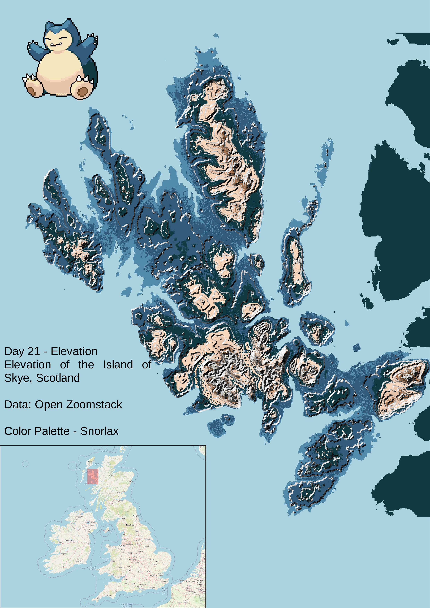

# 30 Days Map Challenge 2021 (Pokemon Edition)
Each map will use a different color palette from the [Pokemon Color Palettes](https://plugins.qgis.org/styles/103/) for QGIS available in QGIS HUB.  
All maps, unless stated otherwise, are made using only QGIS.

|Day|Date|Theme|Done|Ideas|Color palette|
|---|----|-----|----|-----|-------------|
1|01-11-2021|Points|&check;|Coutries whose centroids are disjoint|Abra|
2|02-11-2021|Lines|&check;|San Francisco roads (OSM)|Nidorina|
3|03-11-2021|Polygons|&check;|San Francisco buildings (OSM)|Nidorino|
4|04-11-2021|Hexagons|&check;|Hexagons of population, South America|Pikachu|
5|05-11-2021|Data challenge 1: OpenStreetMap|&check;|A literal streep map|Onix|
6|06-11-2021|Red|&check;|London - Buildings, Railroads, Greenspaces|Charmander|
7|07-11-2021|Green|&check;|London - Buildings, Railroads, Greenspaces|Bulbasaur|
8|08-11-2021|Blue|&check;|London - Buildings, Railroads, Greenspaces|Squirtle|
9|09-11-2021|Monochrome|&check;|Rivers & Lakes in North America|Ditto|
10|10-11-2021|Raster|&check;|Mars DEM|Gastly|
11|11-11-2021|3D|&check;|Extruded Buildings Tel Aviv, by OSM height\levels|Porygon|
12|12-11-2021|Population|&check;|Urban Centers Population Growth in Great Britain|Victreebell|
13|13-11-2021|Data challenge 2: Natural Earth|&check;|Just a bunch of Natural Earth layers|Nidoqueen&Nidoking|
14|14-11-2021|Map with a new tool|&check;|San Francisco elevation hexagons|Venusaur|
15|15-11-2021|Map made without using a computer|&check;|Pokemon Leaf Green Kanto Map (screenshoted from phone)|Golbat|
16|16-11-2021|Urban/rural|&check;|Urban Areas of Italy|Scyther|
17|17-11-2021|Land|&check;|Gray Earth with Shaded Relief|Rhyhorn|
18|18-11-2021|Water|&check;|Bathymetry & names in the Atlantic Ocean|Seel & (a bit of) Seaking|
19|19-11-2021|Island(s)|&check;|Islands withing lakes, within Islands|Lapras|
20|20-11-2021|Movement|&check;|Hurricane Katrina path (2005)|Tentacruel|
21|21-11-2021|Elevation|&check;|Isle of Skye Tanaka Contours|Snorlax|
22|22-11-2021|Boundaries|&check;|Middle Earth Realms|Doduo & Farfetchd|
23|23-11-2021|Data challenge 3: GHSL Global Human Settlement Layer||Urban Centre Database UCDB R2019A ||
24|24-11-2021|Historical map||||
25|25-11-2021|Interactive map||Honeymoon roadtrip||
26|26-11-2021|Choropleth map||||
27|27-11-2021|Heatmap||a literall map of where it's hot|Magmar|
28|28-11-2021|The Earth is not flat|&check;|globe with stars, countries colored by last census|Machoke|
29|29-11-2021|NULL|&check;|Countries Without Railroads|missingNo|
30|30-11-2021|Metamapping day||Blog Post||

## Map 1 - Points

A map showing the centroids (and polygons, I'm not a monster) of all the countries that do not contain their centroids,   
meaning the center of the country is outside of its borders.   
The maps background and features are styled using the **Abra** color palette.  


## Map 2 - Lines

Maps 2 and 3 belong to the same project, except for the roads layer in map 2 and the buildings layer in map 3 they are the same.  
The switch in symbology is done using map themes and an expression that check if a specific layer is visible.  
Map showing the roads in San Francisco, California, United States, Clipped to the shape of the pokemon **Nidorina** hiding in tall grass.  
Clipping was done with a traced polygon in the map layout, and background created with a random marker fill over a white simple fill.   
The maps background and features are styled using the **Nidorina** color palette.  


## Map 3 - Polygons

Maps 2 and 3 belong to the same project, except for the roads layer in map 2 and the buildings layer in map 3 they are the same.  
The switch in symbology is done using map themes and an expression that check if a specific layer is visible.  
Map showing the buildings in San Francisco, California, United States, Clipped to the shape of the pokemon **Nidorino** hiding in tall grass.  
Clipping was done with a traced polygon in the map layout, and background created with a random marker fill over a white simple fill.   
The maps background and features are styled using the **Nidorino** color palette.  


## Map 4 - Hexagons

Map showing South Americe split into hexagons 50km high and wide anc colored by population estimate,   
without a legend because the colors have exactly 0 meaning and the ramp is not graduated.    
The grid was created in QGIS and then connected to a Natural Earth countries layer through a spatial join.  
The maps background and features are styled using the **Pikachu** color palette.


## Map 5 - Data challenge 1: OpenStreetMap

Map showing the roads in Tel Aviv - Yafo, Israel (focused because I used a larger land polygon and the coastline was messed up),  
The maps background and features are styled using the **Onix** color palette.  


## Map 6 - Red

Days 6,7,8 all show the same data, but in different color palettes,  
For this I took a similiar approach to how my wife makes these maps,  
but in pokemon colors, if you're looking for a good looking map of London,   
you can check out [her etsy shop](https://www.etsy.com/il-en/listing/1101325891/london-city-map-choose-your-color)

<a href="https://www.etsy.com/il-en/listing/1101325891/london-city-map-choose-your-color"></a>

Map showing the buildings, greenspaces, and railroads in London, England, United Kingdom.

The maps background and features are styled using the **Charmander** color palette. 

data from Open Zoomstack - OS data © Crown copyright and database right 2021


## Map 7 - Green

Days 6,7,8 all show the same data, but in different color palettes,  
For this I took a similiar approach to how my wife makes these maps,  
but in pokemon colors, if you're looking for a good looking map of London,   
you can check out [her etsy shop](https://www.etsy.com/il-en/listing/1101325891/london-city-map-choose-your-color)

The maps background and features are styled using the **Bulbasaur** color palette. 

data from Open Zoomstack - OS data © Crown copyright and database right 2021  


## Map 8 - Blue

Days 6,7,8 all show the same data, but in different color palettes,  
For this I took a similiar approach to how my wife makes these maps,  
but in pokemon colors, if you're looking for a good looking map of London,   
you can check out [her etsy shop](https://www.etsy.com/il-en/listing/1101325891/london-city-map-choose-your-color)

The maps background and features are styled using the **Squirtle** color palette. 

data from Open Zoomstack - OS data © Crown copyright and database right 2021  


## Map 9 - Monochrome

Map showing rivers and lakes in North America, all data form Natural Earth, rivers width by scale.  
The maps background and features are styled using the **Ditto** color palette.   


## Map 10 - Raster

A map created using a data elevation model (DEM) of Mars [freely available from NASA](https://astrogeology.usgs.gov/search/map/Mars/GlobalSurveyor/MOLA/Mars_MGS_MOLA_DEM_mosaic_global_463m) along with some digitized features around the Valles Marineris and Olympus Mons (the tallest mountain in the solar system).  
The map was styles with th **Gastly** color palette.  


## Map 11 - 3D

Map showing extruded buildings and roads in Tel Aviv - Yafo, Israel.   
extrusion is by z factor for roads, for buildings extrusion is by height when available, number of levels (times 4 meters),  
or 8 meters when neither height or levels is available.  
The maps background and features are styled using the **Porygon** color palette. 


## Map 12 - Population

Map showing population change in Great Britain urban centers,  
Data is from the European Commission's Global Human Settlement Layer, Urban Centre Database 2015,  
displayed over the land layer from Open Zoomstack which is  OS data © Crown copyright and database right 2021   
No idea why Open Zoomstack doesn't iclude North Ireland.
The maps background and features are styled using the **Victreebel** color palette. 


## Map 13 - Data challenge 2: Natural Earth

Map displaying some of the Natural Earth available layers,  
layers shown are: Land, Bathymetry, Parks & Protected Areas, Urban Areas, RIver, Lakes, Airports and Sea Ports.  
Data is obviously from Natural Earth.
Since I used so many layers had to use more than one palette for this, so background and features are styled using the **Nidoqueen** and **Nidoking** color palettes.  


## Map 14 - Map with a new tool

Used <a href="https://studio.unfolded.ai">Unfolded Studio</a> to create this map,  
Just started it out and used a shared dataset which was called San Francisco elevation and seems to be divided into H# placekey hexagons.  
Changed the color scale to use **Venusaur** colors.  


## Map 15 - Map made without using a computer

For this one I just screenshot the Kanto region map fro Pokemon Leaf Green from an emulator on my phone.  
Used QGIS to add stripes over it to get a filter with **Golbat** Color Palette.  


  
My Wife said using the phone was cheating so I also made a second map, which is my neighborhood, colored by (pretty much) the **Golbat** colors.  


## Map 16 - Urban/rural

Map showing the urban areas of Italy according to Natural Earth.  
Used an expression to filter out polygons outside of Italy in the symbology 
```py
    if(
        intersects( 
            transform( $geometry,'EPSG:4326',@project_crs ) ,
            geometry(
                get_feature( 'ne_countries','name','Italy')
                )
            ),
         "scalerank" ,99)
```  
The maps background and features are styled using the **Scyther** color palette.  


## Map 17 - Land

Map of one layer with a lot of names: "Gray Earth with Shaded Relief, Hypsography, Ocean Bottom, and Drainages"  
From Natural Earth, focused on the Indian Subcontinent
The maps background and features are styled using the **Rhyhorn** color palette. 


## Map 18 - Water

Map of bathymetry and names in the Atlantic Ocean, data from Natural Earth.  
The **Seel** palette turned out great, even though I thought about using **Nidoqueen** again since it turned out great in day 13.  
The maps background and features are styled using the **Seel** and a bit of the **Seaking** color palettes. 


## Map 19 - Island(s)

Map of Islands, Inside Lakes, Inside Islands, Inside Lakes.  
Volcan point on Volcano Island in Taal Lake, Philipines, and Inception Island in Nunavut, Canada.  
The maps background and features are styled using the **Lapras** color palette. 


## Map 20 - Movement

Map of the path of Hurricant Katrina from august 2005.  
Data taken from [NOAA](https://www.coast.noaa.gov/hurricanes/#map=4.5/31.99/-82.35&search=eyJzZWFyY2hTdHJpbmciOiJLQVRSSU5BIDIwMDUiLCJzZWFyY2hUeXBlIjoibmFtZSIsIm1hdGNoIjoiZXhhY3QiLCJjYXRlZ29yaWVzIjpbIkg1IiwiSDQiLCJIMyIsIkgyIiwiSDEiLCJUUyIsIlREIiwiRVQiXSwieWVhcnMiOltdLCJtb250aHMiOltdLCJlbnNvIjpbXSwicHJlc3N1cmUiOnsicmFuZ2UiOlswLDExNTBdLCJpbmNsdWRlVW5rbm93blByZXNzdXJlIjp0cnVlfSwic2VsZWN0ZWRTdG9ybUlEIjoiMjAwNTIzNk4yMzI4NSIsImJ1ZmZlclVuaXQiOlsiTWlsZXMiXSwic29ydFNlbGVjdGlvbiI6eyJ2YWx1ZSI6InllYXJzX25ld2VzdCIsImxhYmVsIjoiWWVhciAoTmV3ZXN0KSJ9LCJhcHBseVRvQU9JIjpmYWxzZSwiaXNTdG9ybUxhYmVsc1Zpc2libGUiOnRydWV9) and colored and sized by wind speed and pressure.  
The maps background and features were colored with the **Tentacruel** color palette.  
The video was captures directly from the canvas in QGIS and contains some of the new annotation layers.


## Map 21 - Elevation

Map of the elevation in the Isle of Skye, Scotland, with some Tanaka contours, added a small cutout of OpenStreetMap for reference.  
Data is from Open Zoomstack - OS data © Crown copyright and database right 2021 
Elevation was colored with the **Snorlax** color palette, background is OpenStreetMap Ocean blue.  

  

## Map 22 - Boundaries

Map of the boundaries of Middle Earth, both known kingdoms of men borders, the Elf woods, the Ent woods and Mordor where shadows lie.  
Data from [GIS & Middle Earth (Robert A. Rose, 2020)](https://scholarworks.wm.edu/asoer/3/).  
Background and features were colored with the **Doduo** and **Farfetchd** color palettes.


## Map 23 - Data challenge 3: GHSL Global Human Settlement Layer

Map of the urban centers in Iceland according to the Global Human Settlement Layer's Urban Centre Database UCDB R2019A.  
Since I used this dataset already in day 12, had to add some more data from OpenStreetMap (land, glaciers, water, bare rock) to add some colors.  
Background and features were colored with the **Nidoran♀** color palette since it's the best color palettes I could find that had blue(ish) and red(ish) for Iceland.  


## Map 24 - Historical map

## Map 25 - Interactive map

## Map 26 - Choropleth map

## Map 27 - Heatmap

## Map 28 - The Earth is not flat

Map showing a globe create using the tutorial from [QGIS Map Design](https://locatepress.com/book/qmd2) by Anita Graser and Gretchen N. Peterson,  
countries colored by year of last census. Data is from Natural Earth.  
The maps and features are styled using the **Machoke** color palette, background is black with random markers for stars.   


## Map 29 - NULL

Map of countries without railroads, legend is missing, and the color palette isn't included in [Pokemon Color Palettes](https://plugins.qgis.org/styles/103/)  
The data is from Natural Earth.  
The map's background and features are styled using the **MissingNo**.  


## Day 30 - Metamapping day


### #30DayMapChallenge created by Topi Tjukanov

The official repository with the instructions and code of conduct available at [tjukanovt/30DayMapChallenge](https://github.com/tjukanovt/30DayMapChallenge).